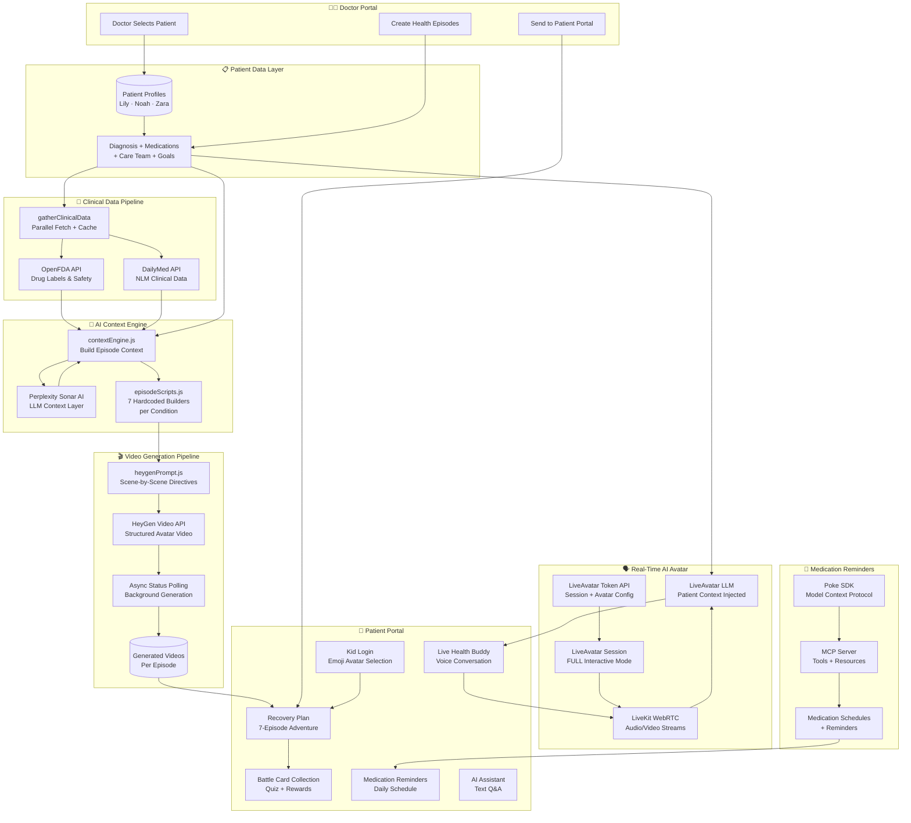
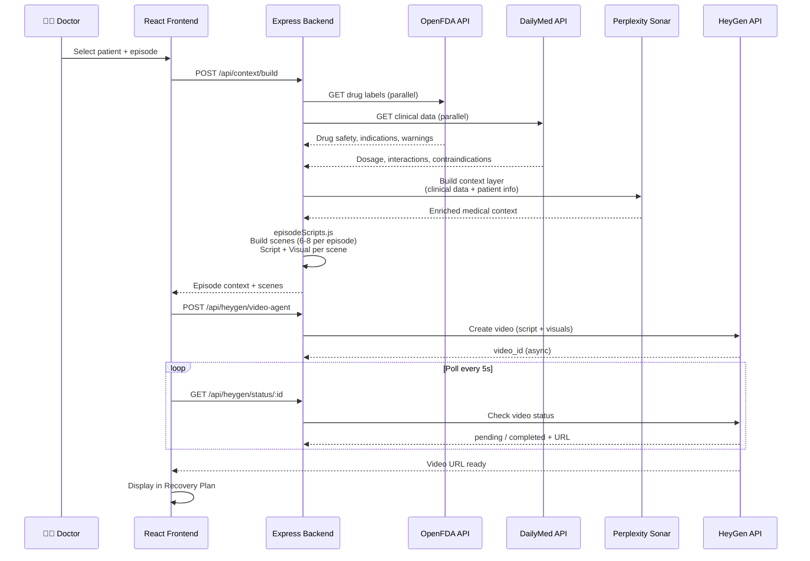
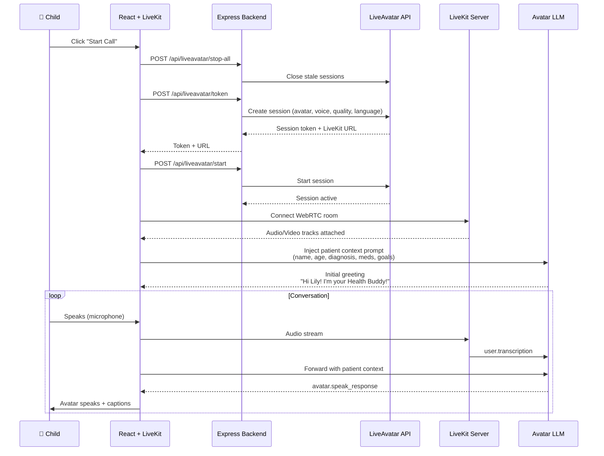
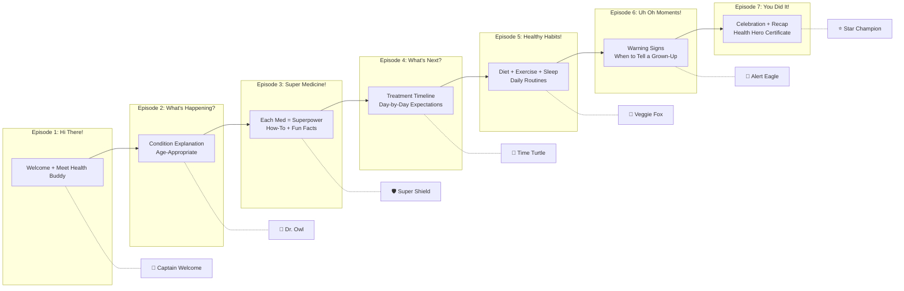

# MedFlix Prime Care

**AI-powered health education for children — transforming dense medical files into bite-sized, personalized video episodes that kids actually want to watch.**

---

## The Problem

- Children diagnosed with conditions like **asthma, ear infections, or leukemia** are scared and confused
- Medical discharge papers are written for adults — kids can't understand them
- Parents are overwhelmed and forget 40–80% of what doctors tell them
- There's no engaging, age-appropriate way for kids to learn about their own health

## The Solution

MedFlix takes a child's real medical data and turns it into a **7-episode animated health show** — personalized to their name, diagnosis, medications, and care team. Kids also get a **real-time AI Health Buddy** they can talk to, **collectible battle cards** for completing episodes, and **picture-based quizzes** to reinforce learning.

---

## System Architecture



---

## Data Flow — Video Generation



---

## Data Flow — LiveAvatar Conversation



---

## Episode Pipeline — Per Condition



Each episode unlocks a **collectible Battle Card** + **picture-based quiz**.

---

## Supported Conditions

| Condition | Patient | Age | Key Medications |
|-----------|---------|-----|-----------------|
| Childhood Asthma | Lily Chen | 4 | Albuterol (rescue), Flovent (daily controller) |
| Ear Infection (Otitis Media) | Noah Martinez | 3 | Amoxicillin (antibiotic), Children's Tylenol |
| Acute Lymphoblastic Leukemia | Zara Thompson | 10 | Vincristine (chemo), Prednisone, Ondansetron |

---

## Tech Stack

| Layer | Technology | Purpose |
|-------|-----------|---------|
| **Frontend** | React 18, Vite, Tailwind CSS | Kid-friendly responsive UI |
| **Backend** | Node.js, Express.js | API orchestration server |
| **Video AI** | HeyGen API | Personalized avatar video generation |
| **Live AI** | HeyGen LiveAvatar + LiveKit | Real-time voice AI conversation |
| **Context AI** | Perplexity Sonar API | LLM-powered medical context layer |
| **Drug Data** | OpenFDA API | FDA drug labels, safety, indications |
| **Clinical Data** | DailyMed / NLM API | Clinical dosage, interactions |
| **Reminders** | Poke SDK (MCP) | Medication reminders via Model Context Protocol |
| **Real-Time** | LiveKit (WebRTC) | Audio/video streaming |
| **Icons** | Lucide React | UI iconography |
| **Storage** | LocalStorage | Demo-friendly client-side persistence |

---

## Quick Start

```bash
# 1. Clone
git clone https://github.com/Michael-600/MedFlix.git
cd MedFlix

# 2. Install frontend
npm install

# 3. Install backend
cd server && npm install && cd ..

# 4. Configure environment
# Create server/.env with:
#   HEYGEN_API_KEY=your_key
#   LIVEAVATAR_API_KEY=your_key
#   PERPLEXITY_API_KEY=your_key
#   POKE_API_KEY=your_key
#   PORT=3001

# 5. Start backend
cd server && node index.js &

# 6. Start frontend
cd .. && npm run dev
```

Frontend: `http://localhost:5173` | Backend: `http://localhost:3001`

---

## Project Structure

```
MedFlix/
├── src/                            # React Frontend
│   ├── main.jsx                    # App entry point
│   ├── App.jsx                     # Router setup
│   ├── index.css                   # Global styles (Tailwind)
│   ├── components/                 # UI Components
│   │   ├── RecoveryPlan.jsx        # 7-episode adventure view
│   │   ├── DayCard.jsx             # Episode card + quiz + battle card
│   │   ├── VideoPlayer.jsx         # HeyGen video playback
│   │   ├── LiveAvatar.jsx          # Real-time AI voice conversation
│   │   ├── AIAssistant.jsx         # Text-based Health Buddy
│   │   ├── CreateContent.jsx       # Doctor content creation
│   │   ├── MedicationReminders.jsx # Poke medication tracking
│   │   ├── Header.jsx              # Navigation
│   │   └── Logo.jsx                # App logo component
│   ├── pages/
│   │   ├── Landing.jsx             # Public homepage
│   │   ├── Login.jsx               # Role selection (Doctor / Kid)
│   │   ├── DoctorPortal.jsx        # Doctor's patient management
│   │   └── PatientPortal.jsx       # Kid's health adventure
│   ├── contexts/
│   │   └── AuthContext.jsx          # useAuth() hook, localStorage persistence
│   ├── data/
│   │   ├── patientData.js          # 3 kid patient profiles
│   │   ├── quizData.js             # Quiz questions + battle cards
│   │   └── mockData.js             # Defaults, medications, AI responses
│   ├── utils/
│   │   └── storage.js              # localStorage wrapper with "medflix_" prefix
│   └── api/
│       └── clinicalDataTool.js     # OpenFDA + DailyMed client
│
├── server/                         # Node.js Backend
│   ├── index.js                    # Express API server (all routes)
│   ├── contextEngine.js            # Clinical data → episode context
│   ├── episodeScripts.js           # 7 hardcoded episode builders
│   ├── heygenPrompt.js             # Video generation prompt builder
│   ├── perplexitySonar.js          # Perplexity AI integration
│   ├── clinicalSearch.js           # ClinicalTrials.gov search (server-side)
│   ├── openfdaClient.js            # OpenFDA drug data client
│   ├── dailymedClient.js           # DailyMed drug label client
│   ├── pokeMcp.js                  # Poke MCP server (stdio)
│   └── mcp/                        # MCP tools for Poke agent
│       ├── main.js                 # MCP server entry point
│       ├── createServer.js         # Server factory + tool registration
│       ├── api.js                  # Shared API helpers
│       └── tools/
│           ├── index.js            # Tool registry
│           ├── getPatientContext.js # Patient info lookup
│           ├── getMedicationSchedule.js # Medication schedule lookup
│           ├── searchClinicalEvidence.js # ClinicalTrials.gov search
│           ├── researchMedicalTopic.js  # Perplexity Sonar research
│           ├── logMedicationTaken.js    # Log adherence events
│           └── sendReminder.js          # Send reminder via Poke
│
├── README.md                       # ← You are here
├── server/README.md                # Backend documentation
└── src/README.md                   # Frontend documentation
```

---

## Team

Built for [Hackathon Name] by the MedFlix Prime Care team.

---

*"Every child deserves to understand their own health — in words they can actually understand."*
